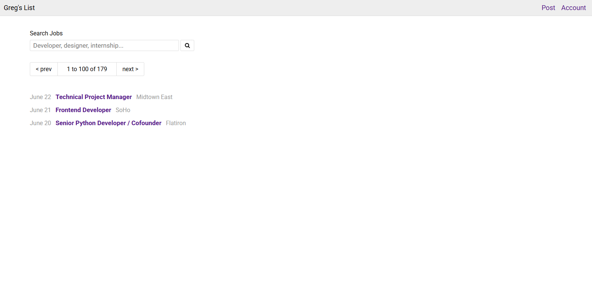

# Greg's List

A simple job board web application inspired by Craigslist.  
This project demonstrates clean layout structure, search interface design, and job listing presentation using front-end development fundamentals.

## 🌐 Live Demo

🔗 https://edaviesc.github.io/gregs_list/

---

## 📸 Preview



---

## 📖 About The Project

Greg's List is a minimalist job search interface that allows users to:

- Search for jobs using keywords
- Browse paginated job listings
- View job titles, dates, and locations
- Navigate between result pages

The design focuses on clarity, usability, and structured content layout.

---

## 🛠 Built With

- HTML5
- CSS3
- Responsive layout principles
- Semantic markup
- Basic UI structure and navigation patterns

---

## 🎯 Features

- Search input with icon button
- Pagination controls (Prev / Next)
- Structured job listing layout
- Clean typography and spacing
- Simple navigation (Post / Account)

---

## 📂 Project Structure

```plaintext
gregs_list/
│── index.html
│── styles.css
│── gregslist.jpg


---

## 🚀 Purpose

This project was built to practice:

- Layout alignment and spacing
- UI component structuring
- Search bar styling
- Pagination design
- Clean front-end presentation

It reflects foundational front-end development skills and interface thinking.

---

## 📌 Author

**Emlyn Davies-Cole**  
Architectural Designer transitioning into Web Development  
Focused on clean structure, visual clarity, and user-centered design.

---

## 📄 License

This project is open source and available under the MIT License.
